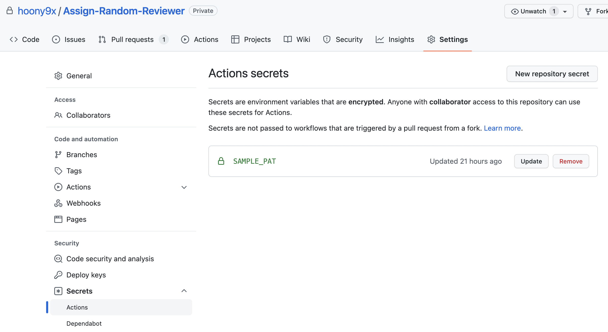

# Assign Random Reviewer

Pick member randomly from pre-defined group and assign as reviewer.

## How To Use

Add GitHub Action like below.

```yaml
name: YOUR_ACTION_NAME
on:
  pull_request:
    types:
      - opened

jobs:
  sample:
    runs-on: ubuntu-latest  # Set your preferred runner
    name: Sample  # Set your job name
    steps:
      - name: Checkout
        uses: actions/checkout@v3
      - name: Sample action
        uses: hoony9x/Assign-Random-Reviewer@v1
        with:
          github-token: ${{ secrets.SAMPLE_PAT }}
          target-organization-name: TARGET_ORG_NAME  # Set target organization name
          target-team-name: TARGET_TEAM_NAME  # Team should be associated with organization
          pr-repo-owner: REPO_OWNER_NAME  # Set organization name that owns repository. (Can be different from `target-organization-name`)
          pr-repo-name: REPO_NAME  # set your repository name
          pr-number: ${{ github.event.pull_request.number }}  # do not change
          pr-author: ${{ github.event.pull_request.user.login }}  # do not change
```

Before use, you have to set PAT as secrets in your repository, like below.



Also, PAT must have proper permission
- to get members from organization and teams
- and assign reviewer